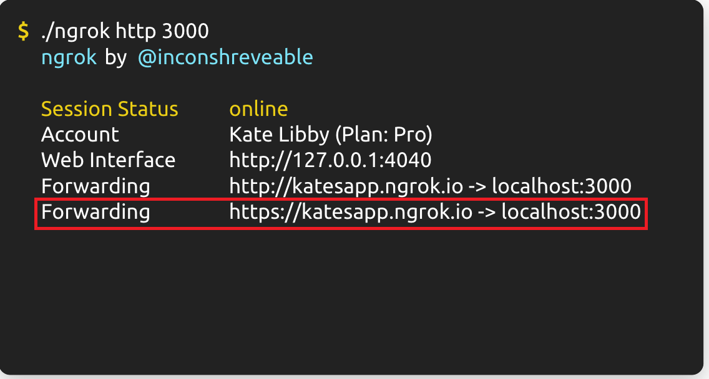
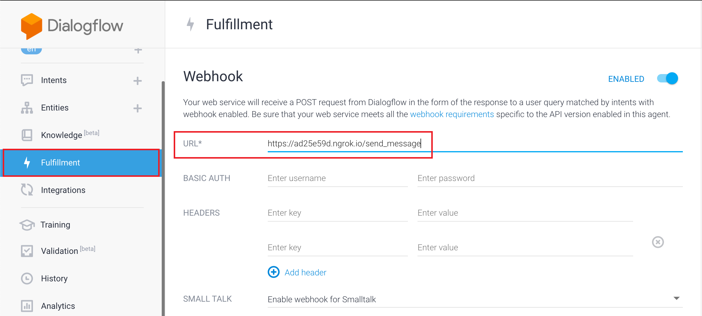
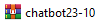

Prerequisite
----------------

#. Python version 2.7 or later version.
#. Pip latest version.
#. Replace pusher credentials, google credentials, dialogflow project ID in the .env file.
#. Replace the Amazon Lex credentials in evaluation.js and home-lex.js.

|

Before you begin
----------------

.. code-block:: shell

    pip install -r req.txt

|

.. note::

  **The requirement text file contain all required packages to run the platform.**

|

.. code-block:: shell

    pip install ngrok

|

.. note::

	**It connects to the ngrok cloud service which accepts traffic on a public address and relays that traffic through to the ngrok process running on your machine and then on to the local address you specified.**

|

.. note::

  **It creates a webhook for the localhost, and it connects to the ngrok cloud services. It is highly recommended to use the https link for security purposes.**

|

|

.. note::

	**The link that is generated by ngrok will be used for Dialogflow webhook to receive POST request.**

|

Dialogflow
----------------

|

|

.. note::

	**This file contains all the setup for this project in Dialogflow and can be restored when creating a new account.**

|

How To Run The Platform
-----------------------

.. code-block:: shell

    flask run

|

.. note::

	**In the .flaskenv file, the command for running the platform has been linked to "flask run".**
